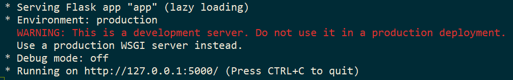

## Vend-O-Matic
Beverage vending machine that being tested via HTTP before being placed into a production environment (believed to be the lobby of a Goodyear Tire franchise).

## Pre-Requisites
This program is built utilizing Python and Flask, so make sure to install this using:

```sudo pip install flask```

More info: [Flask documentation](https://palletsprojects.com/p/flask/)

If you don't have Python installed:

[Python Installation (Mac)](https://docs.python.org/3/using/mac.html)

[Python Installation (PC)](https://docs.python.org/3/using/windows.html)

## Installation
In the terminal, clone this repo then `cd` into the directory it creates.

Mac users - Run the command `python app.py`

Windows users = run `winpty python.exe app.py`

You should see a message to notify you that the Flask service is running:


## Testing
Keep the previous terminal running and open a second terminal window.

At this point, you can utilize `curl` to test the various endpoints of the vending machine via the terminal.

Examples:

`curl -i -X DELETE http://127.0.0.1:5000/`

`curl -i -X PUT http://127.0.0.1:5000/ -d '{"coin":1}'` (Mac)

`curl -i -X PUT http://127.0.0.1:5000/ -d "{\"coin\":1}"` (PC)

`curl -i -X GET http://127.0.0.1:5000/inventory`

`curl -i -X GET http://127.0.0.1:5000/inventory/<int:inventory-id>`

`curl -i -X PUT http://127.0.0.1:5000/inventory/<int:inventory-id>`

VEND AWAY!

